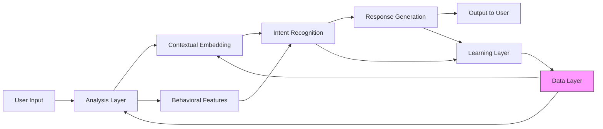

# AI Companion — Personal Adaptive Conversational Agent

A modular, privacy-first AI companion system that learns and adapts to individual users over time. This repository implements a lightweight, explainable pipeline for behavioral analysis, custom embeddings, intent recognition (novel, library-free approach), adaptive response generation, and continuous learning — all designed to run locally with encrypted storage.

Quick highlights
- Custom, deterministic character n-gram embeddings (no pretrained models)
- Behavioral feature extraction (typing speed, punctuation, emoji usage)
- Novel intent recognition using phrase-history graphs, similarity ensembles, and behavioral/personality filters
- Small, numpy-based personality MLP for compact personality vectors
- SQLite storage with Fernet (cryptography) encryption for local privacy
- Flask wrapper for real-time local interactions and an in-process interactive client
- Modular codebase intended for incremental improvement and explainability

Table of contents
- Project structure
- Installation
- Configuration
- Running the API (local)
- Running the in-process interactive client
- Example usage
- Tests
- Design & architecture (brief)
- Intent-detection logic (summary)
- Data, privacy and security
- Extensibility & next steps
- Contributing
- License

Project structure
```
ai_companion/
├─ api.py                     # Flask API wrapper for real-time interactions
├─ analysis_layer.py          # Behavioral & semantic analysis functions
├─ architecture.md            # System architecture diagrams (mermaid)
├─ crypto_store.py            # Encryption utilities (Fernet wrapper)
├─ data_layer.py              # SQLite storage + encrypted fields + profile updates
├─ embeddings.py              # Custom CharNGramHasher embeddings
├─ intent_layer.py            # Phrase graph and intent-probability primitives
├─ learning_layer.py          # Update phrase maps, pruning, reinforcement
├─ personality_nn.py          # Small numpy MLP for personality vector
├─ response_layer.py          # Strategy & response generation utilities
├─ __init__.py
examples/
├─ main.py                    # Example end-to-end flow (single message)
├─ run_query.py               # Interactive in-process client (test_client)
tests/
├─ test_embeddings.py
├─ test_personality_nn.py
├─ test_api.py
config.yaml                   # Tuning parameters (learning rates, embedding dim, keys)
requirements.txt              # Python dependencies
run_api.py                    # Convenience runner for the Flask app
README.md                     # (this file)
USAGE_API.md                  # How to run the API
USAGE_NOTES.md                # Additional notes and security guidance
```

Installation
```
# Create virtual environment (recommended)
python -m venv .venv
source .venv/bin/activate        # Linux / macOS
.venv\Scripts\activate           # Windows

# Install dependencies
pip install -r requirements.txt
```

Configuration
- `config.yaml` contains tunable parameters such as:
  - database.path — path to the SQLite DB file
  - encryption.key_file — local key file (Fernet) path (created if missing)
  - embeddings.dim, ngram_min, ngram_max
  - learning short/long term windows, forget_rate, personalities NN params

Example config snippet:
```yaml
database:
  path: "ai_companion_data.sqlite"
encryption:
  key_file: "enc_key.key"
embeddings:
  dim: 128
  ngram_min: 3
  ngram_max: 5
learning:
  short_term_window: 50
  long_term_window: 500
  forget_rate: 0.001
```

Running the Flask API (local)
- Start the API server:
```bash
python run_api.py
```
- By default the server listens at: `http://127.0.0.1:5000`

API endpoints
- GET `/health` — quick health check
  - Response: `{"status": "ok", "time": <unix_ts>}`
- POST `/message` — process an incoming user message
  - Payload (JSON):
    - `message` (string) — required
    - `typing_time_ms` (int) — optional, typing time estimate
    - `metadata` (object) — optional, e.g., {"prefers_direct": True}
    - `user_id` (string) — optional, defaults to local profile
  - Response (JSON) includes:
    - `response` — assistant's generated text
    - `intent`, `confidence`, `urgency`
    - `emotional_probs`, `behavioral`, `deviations`, `memory_snippets`
    - `interaction_id` — DB id when persisted

Example curl:
```bash
curl -X POST http://127.0.0.1:5000/message \
  -H "Content-Type: application/json" \
  -d '{"message":"I'\''m fine", "typing_time_ms":300}'
```

Running the in-process interactive client
- Use the in-process interactive client (no external server required, runs via Flask test_client):
```bash
python examples/run_query.py
```
- Type messages, view responses, optionally edit and re-run the last message.

Example usage (end-to-end)
- Run the API or in-process client as above.
- Send: `"I'm fine."` with `typing_time_ms=400`.
- The system will:
  - extract behavioral features (typing speed, punctuation, emoji usage)
  - compute lightweight char n-gram embeddings
  - retrieve similar past interactions (cosine similarity on embeddings)
  - build recency-weighted contextual embedding
  - compute an emotional probability distribution for the phrase using historical contexts
  - resolve ambiguity and choose an intent label (e.g., "deflecting" vs "genuinely_fine")
  - select response strategy, generate an empathetic/adaptive response
  - persist the interaction (encrypted) and apply lightweight learning updates

Testing
- Run unit tests:
```bash
pytest -q
```
- Tests exercise embeddings consistency, personality MLP behavior, and the API endpoints (using temporary DB/key files).

Design & architecture (brief)
- Layers
  - Data Layer (ai_companion/data_layer.py): encrypted local storage with interaction embeddings and metadata
  - Analysis Layer (ai_companion/analysis_layer.py): behavioral & semantic extraction and contextual embedding
  - Intent Layer (ai_companion/intent_layer.py): phrase history graphs, ensemble-based emotion distributions, personality filters, ambiguity resolution
  - Response Layer (ai_companion/response_layer.py): strategy selection, memory integration, response validation
  - Learning Layer (ai_companion/learning_layer.py): update phrase meaning map, decay/forgetting, reinforce successful patterns
  - Utilities: embeddings (ai_companion/embeddings.py), personality NN (ai_companion/personality_nn.py), crypto (ai_companion/crypto_store.py)

Architecture diagram


Intent-detection logic (summary)
- Inputs:
  - current message embedding (CharNGramHasher)
  - lexical cues (negations, positive/negative token counts)
  - behavioral features (typing speed, punctuation density, emoji count)
  - recency-weighted contextual embedding (build_contextual_embedding)
  - historical phrase mappings (phrase -> past contexts with emotion labels)
- Process:
  - compute similarity between current contextual embedding and historical records of the same phrase or related phrases
  - aggregate emotion labels from top-N similar records, weighted by similarity
  - incorporate behavioral deviations (baselines) and personality filters to bias probabilities
  - resolve ambiguity using auxiliary signals (recent stress spike, short replies)
  - classify urgency by combining behavioral heuristics and emotion probabilities
- Output:
  - an explainable intent label (e.g., "genuinely_fine", "deflecting", "overwhelmed", "needing_support") with confidence and intermediate signals for auditability

Key implementation files:
- `ai_companion/embeddings.py` — CharNGramHasher: deterministic n-gram hashing to vector bins; fast, privacy-friendly
- `ai_companion/analysis_layer.py` — extract_behavioral_features(), analyze_semantic_content(), build_contextual_embedding(), compare_to_baseline()
- `ai_companion/intent_layer.py` — create_phrase_history_graph(), calculate_emotional_probability_distribution(), resolve_ambiguity(), classify_urgency_level()
- `ai_companion/response_layer.py` — select_response_strategy(), generate_contextually_aware_response(), incorporate_memory_references()
- `ai_companion/learning_layer.py` — update_phrase_meaning_map(), prune_outdated_patterns(), strengthen_successful_patterns()

Data, privacy and security
- Messages and sensitive metadata are encrypted using Fernet (symmetric key) and stored in SQLite.
- The encryption key is stored by default in the filesystem (config.encryption.key_file). For production:
  - Replace filesystem key with OS key store or KMS (recommended)
  - Rotate keys carefully and consider HSM/KMS integration
- Local-first: all data and model artifacts are stored locally by default. No external services or pretrained models are required.

Performance & scalability notes
- Retrieval in the current implementation is a linear scan over stored embeddings in SQLite (sufficient for prototyping and local usage).
- For large, long-term histories consider:
  - Adding an ANN index (HNSW/FAISS) for sublinear retrieval
  - Backgrounding heavy learning tasks to worker processes (Celery, RQ)
  - Partitioning historical data into windows and summarizing long-term patterns to reduce memory / compute

Extensibility & customization
- Replace the embedding combiner with an attention mechanism for content-based retrieval
- Replace or augment the personality MLP with a small learned gating network
- Add WebSocket endpoint for incremental typing signals and live empathy adjustment
- Add authentication and rate-limiting for multi-device setups

Contributing
- Contributions are welcome. Suggested workflow:
  - Fork → feature branch → open PR with tests and description
  - Add tests under `tests/` and run `pytest`
  - Keep changes modular (one layer/component per change)

License
- This project is provided as a starting point; please add an explicit license file for your preferred terms.

Contact / next steps
- If you'd like, I can:
  - Add an ANN integration (HNSW) for faster retrieval
  - Provide a “why” endpoint that returns a human-readable explanation for intent decisions
  - Convert the API to FastAPI for async performance and OpenAPI docs
  - Integrate OS-level KMS support for encryption key management

Thank you — enjoy building a personal, adaptive, privacy-first AI companion.