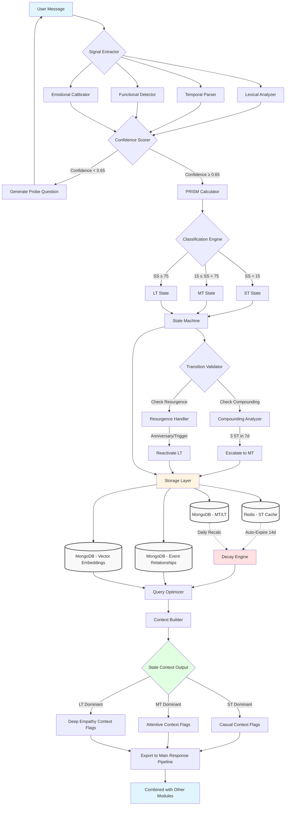

```mermaid
graph TD
    A[User Message] --> B{Signal Extractor}
    
    B --> C[Lexical Analyzer]
    B --> D[Temporal Parser]
    B --> E[Functional Detector]
    B --> F[Emotional Calibrator]
    
    C --> G{Confidence Scorer}
    D --> G
    E --> G
    F --> G
    
    G -->|Confidence < 0.65| H[Generate Probe Question]
    H --> A
    
    G -->|Confidence ≥ 0.65| I[PRISM Calculator]
    
    I --> J{Classification Engine}
    
    J -->|SS < 15| K[ST State]
    J -->|15 ≤ SS < 75| L[MT State]
    J -->|SS ≥ 75| M[LT State]
    
    K --> N[State Machine]
    L --> N
    M --> N
    
    N --> O{Transition Validator}
    
    O -->|Check Compounding| P[Compounding Analyzer]
    P -->|3 ST in 7d| Q[Escalate to MT]
    
    O -->|Check Resurgence| R[Resurgence Handler]
    R -->|Anniversary/Trigger| S[Reactivate LT]
    
    Q --> T[Storage Layer]
    S --> T
    N --> T
    
    T --> U[(Redis - ST Cache)]
    T --> V[(MongoDB - MT/LT)]
    T --> W[(MongoDB - Event Relationships)]
    T --> X[(MongoDB - Vector Embeddings)]
    
    U -.->|Auto-Expire 14d| Y[Decay Engine]
    V -.->|Daily Recalc| Y
    
    Y --> Z[Query Optimizer]
    W --> Z
    X --> Z
    
    Z --> AA[Context Builder]
    AA --> AB{State Context Output}
    
    AB -->|ST Dominant| AC[Casual Context Flags]
    AB -->|MT Dominant| AD[Attentive Context Flags]
    AB -->|LT Dominant| AE[Deep Empathy Context Flags]
    
    AC --> AF[Export to Main Response Pipeline]
    AD --> AF
    AE --> AF
    
    AF --> AG[Combined with Other Modules]
    
    style A fill:#e1f5ff
    style AG fill:#e1f5ff
    style T fill:#fff4e1
    style Y fill:#ffe1e1
    style AB fill:#e1ffe1
    
    classDef storage fill:#f9f9f9,stroke:#333,stroke-width:2px
    class U,V,W,X storage
```
    '''
