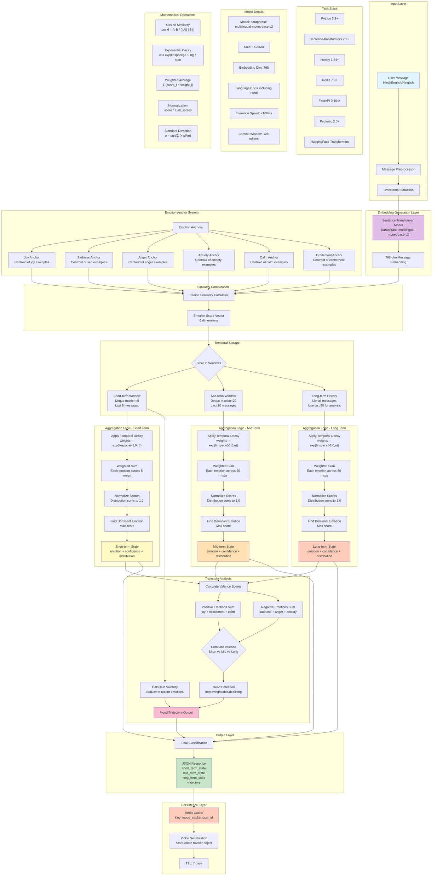

```mermaid
graph TB
    subgraph "Input Layer"
        A[User Message<br/>Hindi/English/Hinglish] --> B[Message Preprocessor]
        B --> C[Timestamp Extraction]
    end

    subgraph "Embedding Generation Layer"
        C --> D[Sentence Transformer Model<br/>paraphrase-multilingual-mpnet-base-v2]
        D --> E[768-dim Message Embedding]
    end

    subgraph "Emotion Anchor System"
        F[Emotion Anchors] --> F1[Joy Anchor<br/>Centroid of joy examples]
        F[Emotion Anchors] --> F2[Sadness Anchor<br/>Centroid of sad examples]
        F[Emotion Anchors] --> F3[Anger Anchor<br/>Centroid of anger examples]
        F[Emotion Anchors] --> F4[Anxiety Anchor<br/>Centroid of anxiety examples]
        F[Emotion Anchors] --> F5[Calm Anchor<br/>Centroid of calm examples]
        F[Emotion Anchors] --> F6[Excitement Anchor<br/>Centroid of excitement examples]
    end

    subgraph "Similarity Computation"
        E --> G[Cosine Similarity Calculator]
        F1 --> G
        F2 --> G
        F3 --> G
        F4 --> G
        F5 --> G
        F6 --> G
        G --> H[Emotion Score Vector<br/>6 dimensions]
    end

    subgraph "Temporal Storage"
        H --> I{Store in Windows}
        I --> J[Short-term Window<br/>Deque maxlen=5<br/>Last 5 messages]
        I --> K[Mid-term Window<br/>Deque maxlen=20<br/>Last 20 messages]
        I --> L[Long-term History<br/>List all messages<br/>Use last 50 for analysis]
    end

    subgraph "Aggregation Logic - Short Term"
        J --> M1["Apply Temporal Decay<br/>weights = exp(linspace(-1,0,n))"]
        M1 --> N1["Weighted Sum<br/>Each emotion across 5 msgs"]
        N1 --> O1["Normalize Scores<br/>Distribution sums to 1.0"]
        O1 --> P1["Find Dominant Emotion<br/>Max score"]
        P1 --> Q1["Short-term State<br/>emotion + confidence + distribution"]
    end

    subgraph "Aggregation Logic - Mid Term"
        K --> M2["Apply Temporal Decay<br/>weights = exp(linspace(-1,0,n))"]
        M2 --> N2["Weighted Sum<br/>Each emotion across 20 msgs"]
        N2 --> O2["Normalize Scores<br/>Distribution sums to 1.0"]
        O2 --> P2["Find Dominant Emotion<br/>Max score"]
        P2 --> Q2["Mid-term State<br/>emotion + confidence + distribution"]
    end

    subgraph "Aggregation Logic - Long Term"
        L --> M3["Apply Temporal Decay<br/>weights = exp(linspace(-1,0,n))"]
        M3 --> N3["Weighted Sum<br/>Each emotion across 50 msgs"]
        N3 --> O3["Normalize Scores<br/>Distribution sums to 1.0"]
        O3 --> P3["Find Dominant Emotion<br/>Max score"]
        P3 --> Q3["Long-term State<br/>emotion + confidence + distribution"]
    end

    subgraph "Trajectory Analysis"
        Q1 --> R["Calculate Valence Scores"]
        Q2 --> R
        Q3 --> R
        R --> S["Positive Emotions Sum<br/>joy + excitement + calm"]
        R --> T["Negative Emotions Sum<br/>sadness + anger + anxiety"]
        S --> U{"Compare Valence<br/>Short vs Mid vs Long"}
        T --> U
        U --> V["Trend Detection<br/>improving/stable/declining"]
        J --> W["Calculate Volatility<br/>StdDev of recent emotions"]
        W --> X["Mood Trajectory Output"]
        V --> X
    end

    subgraph "Output Layer"
        Q1 --> Y[Final Classification]
        Q2 --> Y
        Q3 --> Y
        X --> Y
        Y --> Z[JSON Response<br/>short_term_state<br/>mid_term_state<br/>long_term_state<br/>trajectory]
    end

    subgraph "Persistence Layer"
        Z --> AA[Redis Cache<br/>Key: mood_tracker:user_id]
        AA --> AB[Pickle Serialization<br/>Store entire tracker object]
        AB --> AC[TTL: 7 days]
    end

    subgraph "Tech Stack"
        TS1["Python 3.8+"]
        TS2["sentence-transformers 2.2+"]
        TS3["numpy 1.24+"]
        TS4["Redis 7.0+"]
        TS5["FastAPI 0.104+"]
        TS6["Pydantic 2.0+"]
        TS7["HuggingFace Transformers"]
    end

    subgraph "Model Details"
        MD1["Model: paraphrase-multilingual-mpnet-base-v2"]
        MD2["Size: ~420MB"]
        MD3["Embedding Dim: 768"]
        MD4["Languages: 50+ including Hindi"]
        MD5["Inference Speed: <100ms"]
        MD6["Context Window: 128 tokens"]
    end

    subgraph "Mathematical Operations"
        MO1["Cosine Similarity<br/>cos θ = A·B / (||A|| ||B||)"]
        MO2["Exponential Decay<br/>w = exp(linspace(-1,0,n)) / sum"]
        MO3["Weighted Average<br/>Σ (score_i × weight_i)"]
        MO4["Normalization<br/>score / Σ all_scores"]
        MO5["Standard Deviation<br/>σ = sqrt(Σ (x-μ)²/n)"]
    end

    style A fill:#e1f5ff
    style Z fill:#c8e6c9
    style Q1 fill:#fff9c4
    style Q2 fill:#ffe0b2
    style Q3 fill:#ffccbc
    style X fill:#f8bbd0
    style D fill:#e1bee7
    style AA fill:#ffccbc

```